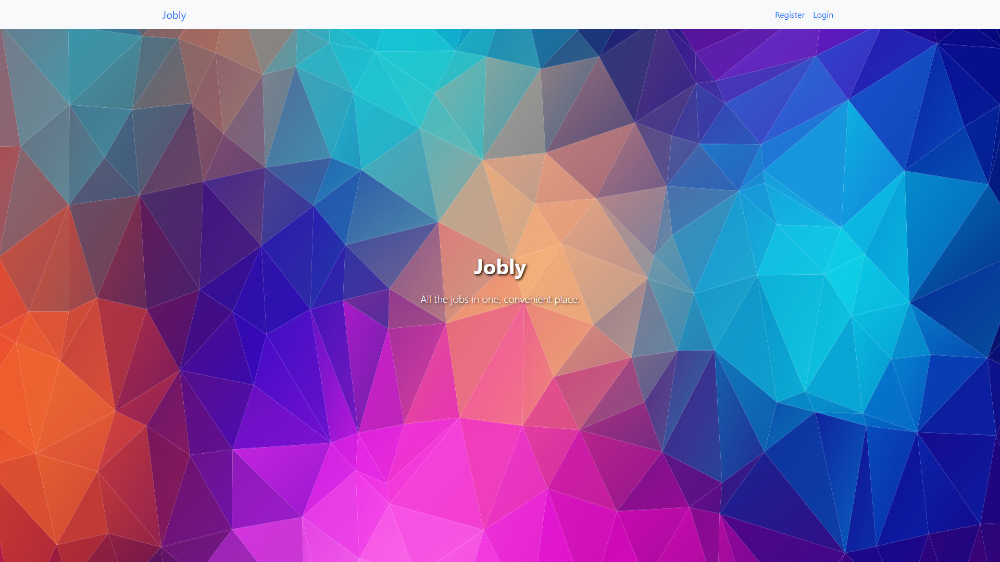

# Jobly

Jobly is a full stack application that is a mock employment website where users can find companies and job listings. It was created in a 5-day sprint while learning React.

## Demo



## Technologies

- express
- React
- PostgreSQL
- Bootstrap

## Features

- Users can login, logout, and register.
- Users can change their profiles.
- Users can find companies and/or jobs by name.
- Users can apply for jobs and check on applied jobs.
- Users can live search so views are re-rendered when typing for a better user experience.
- Uses tokens saved to localstorage which are used for authentication. So if the page refreshes or the user closes the window, the user can still access the application without loggin in.

Routes are protected by the "currUser" which is determined by having a token. Initially experimented with the idea of rendering a Redirect component when not authenticated but visiting a restricted route. Settled on the more declarative way of just not rendering those routes.

```js
<Routes>
  <Route path="/" element={<Homepage />} />
  {currUser && (
    <>
      <Route path="/companies/:handle" element={<CompanyDetail />} />
      <Route path="/companies" element={<CompanyList />} />
      <Route path="/jobs" element={<JobList />} />
      <Route
        path="/profile"
        element={<ProfileForm editProfile={editProfile} />}
      />
    </>
  )}
  {!currUser && (
    <>
      <Route path="/login" element={<LoginForm login={login} />} />
      <Route path="/signup" element={<SignUpForm signUp={signUp} />} />
    </>
  )}
  <Route path="*" element={<Navigate to="/" />} />
</Routes>
```

Live search using a custom debounce function.

```js
function debounce(fn, ms) {
  let id;
  return (...args) => {
    clearTimeout(id);
    id = setTimeout(() => {
      fn.call(this, ...args);
    }, ms);
  };
}

...

<Form className="SearchForm">
  <Form.Group>
    <Form.Control
      onChange={debounce(handleChange, 300)}
      placeholder="Enter search term"
      className="SearchForm-bar mt-5 form-control-lg"
    />
  </Form.Group>
</Form>;
```

Came across an interesting design flaw/bug in our code when using tokens and localstorage. We initially had a useEffect that would fetch the token from localstorage when the component mounted but this would set the "currUser" which depends on the token to be set to "null" and kick the user out as if logged out. This is because in the component life cycle a useEffect runs after the component is rendered. The simple solution without having to rewrite our code to take into account this "intermediate" state was to have a callback in our "token" state setter. Good to keep in mind the order that React hooks run in!

:heavy_check_mark: Initialize State before render

```js
const [token, setToken] = useState(() => localStorage.getItem("token"));
```

:x: Initialize State after render

```js
useEffect(() => {
  const localToken = localStorage.getItem("token");
  if (localToken) {
    setToken(localToken);
  }
}, []);
```

## Contributors

- [cli3338198](https://github.com/cli3338198)
- [jcpalca](https://github.com/jcpalca)
